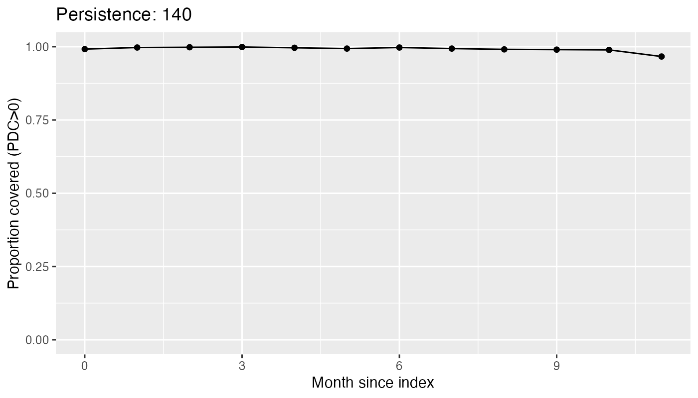
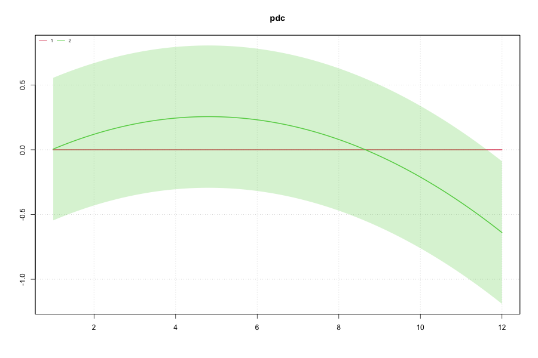

# Synthea OMOP Treatment Trajectory Modeling (R)

End-to-end pipeline for real-world treatment trajectory modeling on OMOP CDM data:
**cohort definition → longitudinal adherence trajectories (PDC) → LCA/GBTM → prediction → report**.

- Data: Synthea OMOP CSV hosted on public S3 (`synthea-omop/synthea1k`)
- Source: https://synthea-omop.s3.amazonaws.com/synthea1k  (queried via DuckDB httpfs)
- Engine: DuckDB + httpfs (query CSVs directly from S3)
- Modeling: poLCA (LCA), gbmt (GBTM), multinomial logistic regression

## Repository structure
- `scripts/` : main pipeline (`synthea_omop_pipeline.R`)
- `reports/`  : optional Quarto template
- `docs/`    : example figures for README
- `outputs/` : generated artifacts (ignored by git)

## What this repo does
1. **Cohort definition**: new-user cohort with washout (default 180 days) from OMOP `drug_exposure`
2. **Trajectory construction**: monthly windows and PDC (covered_days / window_days) for 12 months
3. **Trajectory modeling**:
   - LCA on binary monthly coverage
   - GBTM on continuous PDC
4. **Prediction**: baseline covariates (age/sex; optional labs) → predict trajectory class
5. **Reporting**: exports figures/CSVs; optional Quarto report template

## Quickstart
### Prereqs
- R >= 4.3
- Packages: DBI, duckdb, dplyr, tidyr, lubridate, ggplot2, poLCA, gbmt, rsample, nnet

### Run
```r
install.packages(c(
  "DBI","duckdb","dplyr","dbplyr","tidyr","lubridate",
  "ggplot2","poLCA","gbmt","rsample","nnet","yardstick"
))
source("scripts/synthea_omop_pipeline.R")
```

## Outputs
- `outputs/traj_long.csv`: long-format monthly PDC + coverage
- `outputs/persistence.png`: cohort-level persistence over months
- `outputs/pdc_spaghetti.png`: sample PDC trajectories
- `outputs/lca_model_selection.csv`, `outputs/lca_classes.csv`
- `outputs/gbtm_plot.png` (GBTM model-selection may be unavailable depending on gbmt internals)
- `outputs/prediction_metrics.csv`

## Results (synthea1k example)
- Cohort size: 1107 new users (180-day washout)
- Best LCA: K=2 classes (BIC-selected)
- Prediction (age/sex → class): macro-F1=0.984, accuracy=0.968

## Example figures




## Assumptions & limitations
- This demo uses Synthea OMOP CSV on public S3 and does **not** include OMOP vocabulary/concept tables.
- Therefore cohort definitions rely on `*_source_value` / source codes. For real-world claims/EHR, replace this with concept_id-based definitions and proper drug/condition concept mapping.

## Reproducibility
- Tested with R >= 4.3 on macOS.
- Outputs are written to `outputs/` (ignored by git). Edit `OUT_DIR` in the script to customize.